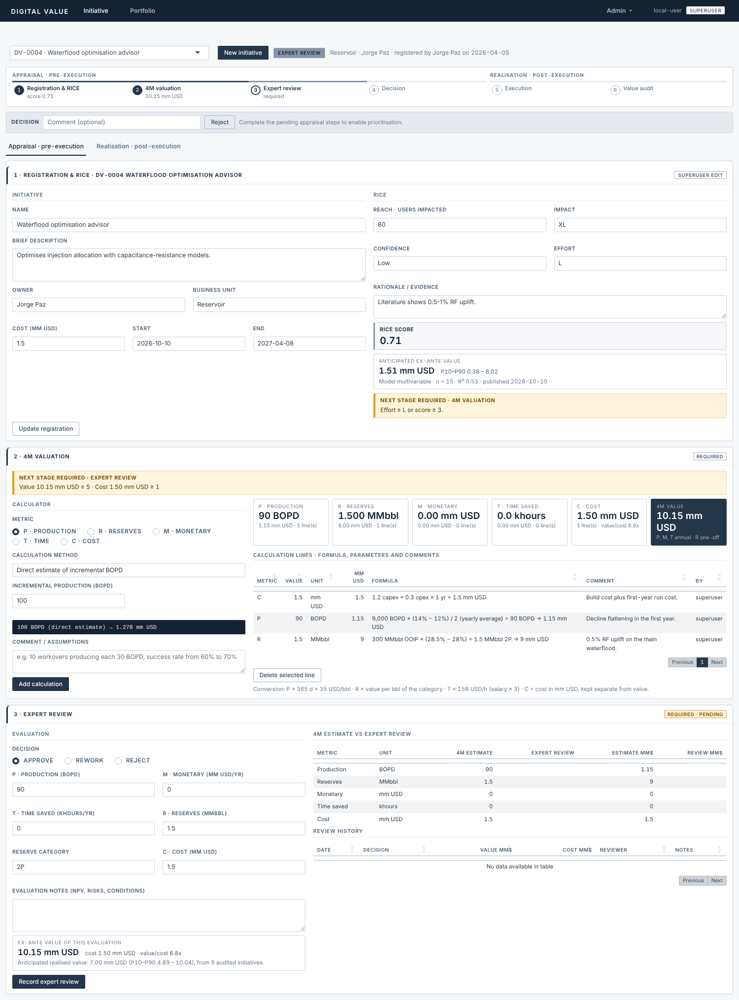
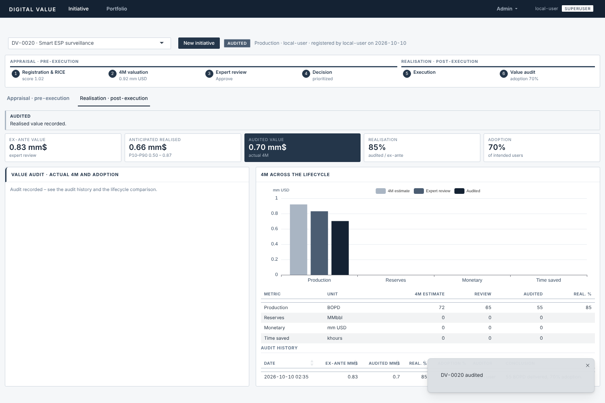
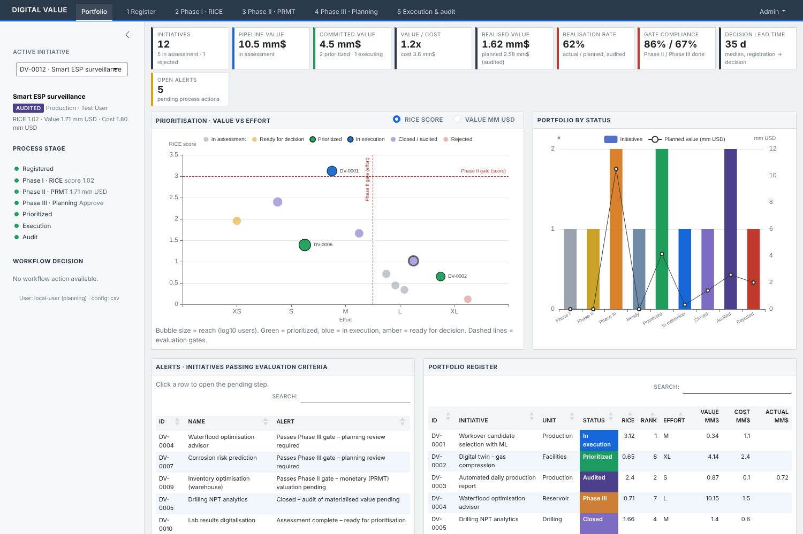
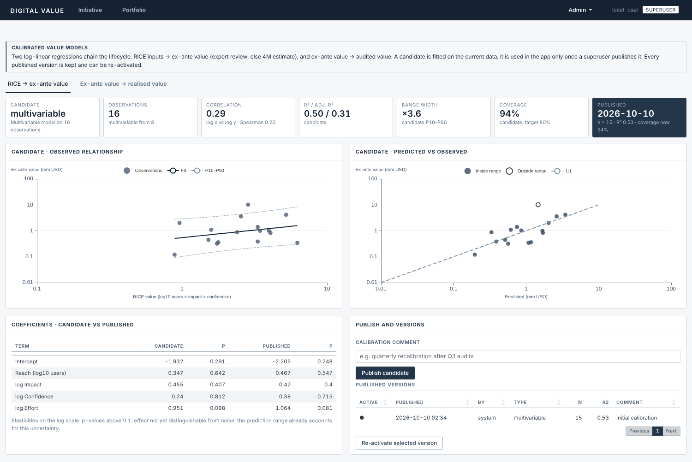
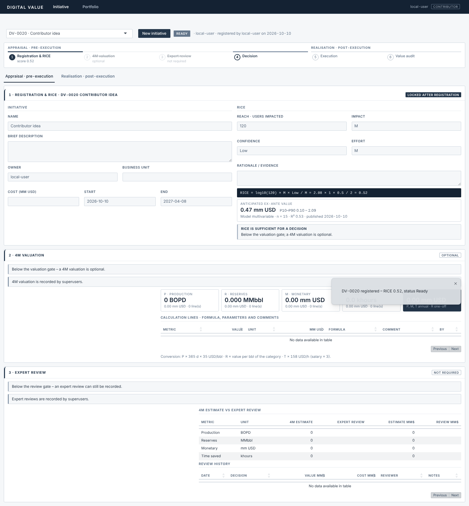

# digitalvalue — Digital Initiatives Value Assessment

Shiny application, built as an R package, for recording digital initiatives and following their value from the idea to the audit of what was actually delivered. Data are stored in **DuckDB**.

The app has two main tabs:

* **Initiative**: select an initiative, or register a new one, and work through its lifecycle.
* **Portfolio**: KPIs, the prioritisation chart, alerts and the register of all initiatives.

Superusers also get an **Admin** menu: Value models, Process log and Parameters.



## Lifecycle

| View | Step | What is recorded | Who | Required when |
|---|---|---|---|---|
| **Appraisal** (pre-execution) | 1 Registration & RICE | Name, description, owner, unit, cost, and the RICE inputs, saved in one form | **Everyone**. The record is then locked; only a superuser can change it | Always |
| | 2 4M valuation | Calculation lines per metric (P, R, M, T), each with its formula, parameters and comment | Superuser | Effort ≥ L or RICE score ≥ 3 (*valuation gate*) |
| | 3 Expert review | Manual evaluation: decision (Approve / Rework / Reject) with its **own 4M figures** and validated cost | Superuser | Ex-ante value ≥ 5 mm USD or cost ≥ 1 mm USD (*review gate*) |
| | 4 Decision | Prioritize or reject | Superuser | — |
| **Realisation** (post-execution) | 5 Execution | Start, then close | Superuser | — |
| | 6 Value audit | **Actual 4M figures plus adoption** (% of the intended users actually using the solution) | Superuser | After closure |

The status always shows the next pending appraisal step (`Registered` → `4M valuation` → `Expert review` → `Ready`) until a decision is taken (`Prioritized`, `In execution`, `Closed`, `Audited`, `Rejected`). It is recalculated after every save, and every change is written to `status_history`.

The **ex-ante value** of an initiative is the expert-review value when the review approved it, otherwise the 4M estimate.

## User levels

| Action | Contributor | Superuser |
|---|:-:|:-:|
| Register an initiative with its RICE | ✓ | ✓ |
| Edit a registration or its RICE after saving | | ✓ |
| 4M valuation, expert review, decisions, value audit | | ✓ |
| Calibrate and publish value models, Admin tabs | | ✓ |

Superusers are identified from the Posit Connect login: members of the group in `DV_SUPERUSER_GROUP`, or users listed in `DV_SUPERUSERS` (comma-separated). When neither variable is set (local development), everyone is a superuser; `DV_DEV_ROLE=contributor` simulates a contributor. Forms a user cannot use are hidden or disabled, and every write is checked again on the server. The matrix is in `permission_matrix()` (`R/fct_roles.R`).

## Valuation logic

### RICE

`score = log10(users) × impact × confidence / effort`, using the weights table `inst/config/rice_scales.csv`:

| Dimension | Levels → weight |
|---|---|
| Impact | XS 0.25 · S 0.5 · M 1 · L 2 · XL 3 |
| Confidence | Moonshot 0.2 · Low 0.5 · High 0.8 · Certain 1 |
| Effort | XS 0.5 · S 1 · M 2 · L 4 · XL 8 |

### 4M metrics

The same four metrics are used at every stage: the 4M valuation, the expert review and the value audit.

| Metric | Calculation methods (4M valuation) | Converted to mm USD by |
|---|---|---|
| **P** Production (avg yearly BOPD) | direct · jobs × rate × success-rate uplift · uptime gain · decline mitigation | BOPD × 365 × netback (35 USD/bbl), annual |
| **R** Reserves (MMbbl) | direct · recovery-factor uplift on OOIP; category 1P / 2P / 3P / contingent | MMbbl × value per bbl of the category (10 / 6 / 3 / 1 USD/bbl), one-off |
| **M** Monetary (mm USD) | direct · events × saving per event · avoided cost × probability reduction | as entered, annual |
| **T** Time saved (khours) | direct · users × h/week × weeks · tasks × minutes saved | khours × 1000 × (salary / work hours) × productivity coefficient **3**, annual |

Each 4M calculation line stores its parameters as JSON together with the formula and a comment, so it can be traced and recomputed:

```
[P] 10 jobs × 30 BOPD × (70% − 60%) = 30 BOPD → 0.383 mm USD
    comment: "10 workovers/yr, each 30 BOPD; ML lifts success from 60% to 70%."
    params:  {"n_jobs":10,"bopd_per_job":30,"success_before":60,"success_after":70}
```

The expert review and the audit record the four figures directly. Their forms are pre-filled from the previous stage, and the Realisation view compares estimate, review and audit metric by metric. To add a calculation method, add an entry to `m4_methods()` in `R/fct_4m.R`; its form is generated from the parameter list.

### Calibrated value models

Two log-linear regressions chain the lifecycle (`R/fct_value_model.R`):

| Model | Target | Predictors | Shown in |
|---|---|---|---|
| RICE → ex-ante value | Ex-ante value (expert review, else 4M estimate) | log10(users), log impact, log confidence, log effort | Registration form, Portfolio estimates and the "Value or estimate" chart view |
| Ex-ante → realised value | Audited value | log ex-ante value, log confidence, log effort | Expert review and Realisation views |

* **Range**: the regression prediction interval, back-transformed from the log scale, reported as median and P10–P90 (`value_model_interval = 0.8`).
* **Few data points**: below `value_model_min_n` (8) observations a simple one-predictor model is used; below 4, no model is fitted.
* **Calibration from the app**: in **Admin → Value models** a superuser fits a *candidate* on the current data. It is shown next to the published version (correlation, R², range width, interval coverage, coefficients and p-values, charts) and published with a comment. Each published version stores its coefficients, covariance matrix and residual sigma in the `value_models` table. Estimates are computed from the published record, so they only change when someone publishes. Earlier versions can be re-activated. On an empty database a first calibration is published automatically once there is enough data.

### Alerts and KPIs

* **Alerts** list initiatives above a gate with a pending step, closed initiatives without an audit, and initiatives ready for a decision. Clicking an alert opens the initiative on the right view.
* **Portfolio KPIs**: pipeline, committed and realised value; value/cost; realisation rate (audited ÷ ex-ante); mean adoption; gate compliance (share of required 4M valuations and reviews actually done); decision lead time; open alerts.
* **Prioritisation chart** (value vs effort, bubble size = reach): single-hue palette, with prioritized initiatives as dark circles and initiatives in execution as the darkest diamonds.

## Architecture

```
R/
  app_ui.R, app_server.R, run_app.R        app shell: two tabs + Admin menu, no sidebar
  mod_initiative_ui.R / _server.R          Initiative tab: selector, stepper, decision bar,
                                           Appraisal / Realisation views
    mod_register_*, mod_valuation_*,       components of the Initiative tab (one ui/server pair each)
    mod_review_*, mod_audit_*
  mod_portfolio_ui.R / _server.R           Portfolio tab
  mod_models_*, mod_process_*,             Admin tabs (superusers only)
  mod_parameters_*
  fct_rice.R, fct_4m.R, fct_gates.R,       business logic: pure functions, unit tested
  fct_roles.R, fct_kpi.R, fct_value_model.R,
  fct_plots.R, fct_process_mining.R
  data_db.R                                ALL database access (single file)
  config.R                                 configuration from pins (Connect) or CSV
  demo_data.R, utils_ui.R
inst/config/*.csv                          parameters, RICE weights, process-mining event map
inst/app/www/styles.css                    monochrome theme
inst/app/www/process_logger.js             client-side activity buffering
tests/testthat/                            unit tests and module server tests (testServer)
```

Charts are built as plain ECharts option lists (`*_option()` functions, unit tested) and rendered with `echarts4r`.

### Configuration

Parameters, gates, RICE weights and the event map are stored as tables:

* **Posit Connect**: set `DV_PINS_BOARD=connect` (and optionally `DV_PINS_OWNER`), then publish the pins once with `digitalvalue::publish_config_pins()`.
* **Local / fallback**: the CSV files in `inst/config`.

Environment variables are used only for infrastructure and identity: `DV_DB_PATH`, `DV_DB_DRIVER`, `DV_PINS_BOARD`, `DV_PINS_OWNER`, `DV_SUPERUSER_GROUP`, `DV_SUPERUSERS`, `DV_SEED_DEMO`.

### Database (DuckDB)

* **File**: `DV_DB_PATH`, default `digitalvalue.duckdb`.
* **Tables**:
  * `initiatives`, `rice`
  * `m4_lines`: 4M calculation lines
  * `reviews`: expert reviews with their 4M figures
  * `audits`: actual 4M figures and adoption
  * `value_models`: published model versions
  * `status_history`, `event_log`
* **Migration to an enterprise database**: only `R/data_db.R` changes. Add a driver branch in `db_connect()` (e.g. `odbc::odbc()`). The SQL is ANSI with `?` placeholders (`sql_params()` rewrites them for PostgreSQL), and timestamps are ISO-8601 UTC text.
* **Single writer**: DuckDB allows only one writing process. On Posit Connect, keep **max processes = 1** during the pilot, or move to a server database before scaling out.

## Process mining

1. **Raw events**: input changes and navigation are captured in the browser, buffered, and sent every 5 s as one JSON input to `event_log`, together with the user, session and active initiative.
2. **Mapped events**: input names are mapped to readable activities and lifecycle phases using regexes in `event_map.csv`. For example, `initiative-valuation-add` becomes "Add 4M calculation" in phase "2 4M valuation".
3. **Activity instances**: consecutive events are grouped into activity instances with start and complete timestamps.
4. **Business log**: status transitions.

**Admin → Process log** exports a standard event log (`case_id`, `activity`, `timestamp`, `resource`, `lifecycle`) for bupaR, pm4py or Celonis.

## Performance

Already in place:
* **Database**: portfolio aggregation runs as one SQL query in DuckDB.
* **Browser**: chart rendering and activity buffering run client-side.
* **Value models**: published models are evaluated from stored coefficients, with no refitting per session.

Proposed next steps:
* **API**: a plumber API on Connect for the RICE / 4M / value-model engine, so other tools can use it.
* **Scheduled jobs**: run the KPI and process-mining aggregations as scheduled jobs and store the results as tables.
* **Caching**: `bindCache()` on the portfolio query.

## Running

```r
pkgload::load_all(); run_app()      # development
shiny::runApp()                      # uses app.R
```

**Posit Connect**: `rsconnect::deployApp(appFiles = c("app.R", "DESCRIPTION", "NAMESPACE", "R", "inst"))`. Set `DV_DB_PATH` to a persistent location, `DV_SUPERUSER_GROUP` (or `DV_SUPERUSERS`) and `DV_PINS_BOARD=connect`.

**Tests**: `devtools::test()`. The tests run on an in-memory DuckDB.

## Screens

| | |
|---|---|
|  |  |
|  |  |
