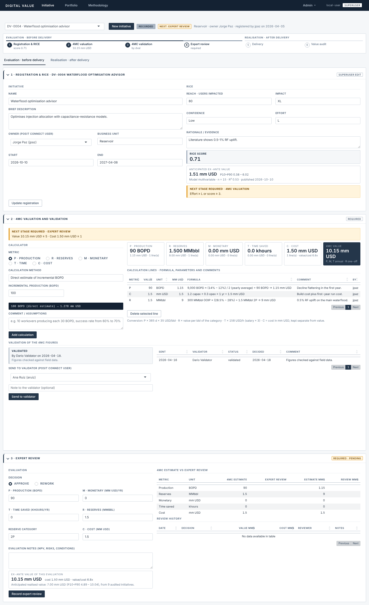
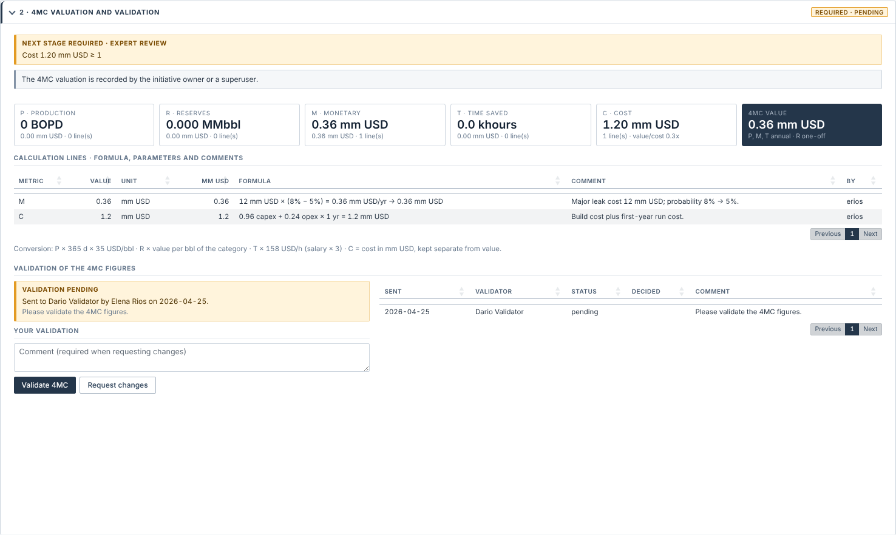

# digitalvalue — Digital Initiatives Value Assessment

Shiny application, built as an R package, for recording digital initiatives and following their value from the idea to the audit of what was actually delivered. Data are stored in **DuckDB**.

The app has two main tabs:

* **Initiative**: select an initiative, or register a new one, and work through its lifecycle.
* **Portfolio**: KPIs, the value-vs-effort and status charts, alerts, the validations waiting for you, and the register of all initiatives. Search an initiative, or click it in the register, to highlight it in the charts; **Open initiative** jumps to it.

A **Methodology** tab, open to everyone, explains the method in **English and Spanish**: a summary with the principles, then one section per step, the gates, the value models, roles, KPIs and a glossary. The text is in `inst/app/methodology/methodology_en.md` and `methodology_es.md`, so it can be edited without touching code. Thresholds, weights and conversion factors are written as `{{placeholders}}` and filled from the active configuration, so the document always matches what the app does.

Superusers also get an **Admin** menu: Value models, Process log and Parameters.



## Lifecycle

Every initiative goes through four statuses: **Recorded → Evaluated → Delivered → Audited**.

* **Recorded** and **Evaluated** are derived from the data: an initiative becomes Evaluated automatically as soon as every evaluation required by the gates is complete.
* **Delivered** is set by the owner (or a superuser). **Audited** is set when a superuser records the value audit.
* The app evaluates and tracks value; it does not approve or reject the execution of initiatives.

| View | Step | What is recorded | Who | Required when |
|---|---|---|---|---|
| **Evaluation** (before delivery) | 1 Registration & RICE | Name, description, owner (searched in the Posit Connect directory), unit, dates and the RICE inputs, in one form | **Everyone**. The record is then locked; only a superuser can modify it | Always |
| | 2 4MC valuation | Calculation lines per metric (P, R, M, T and cost C), each with its formula, parameters and comment | Owner (or superuser) | Effort ≥ L or RICE score ≥ 3 (*valuation gate*) |
| | 3 4MC validation | The owner sends the 4MC to a validator (a Posit Connect user), who validates it or requests changes with a comment. Lines are locked while pending or once validated | Validator | Whenever the 4MC is required |
| | 4 Expert review | Manual evaluation, Approve or Rework, with its **own 4MC figures**, including the validated cost C | Superuser | Ex-ante value ≥ 5 mm USD or cost ≥ 1 mm USD (*review gate*) |
| **Realisation** (after delivery) | 5 Delivery | Mark as delivered (a superuser can revert it) | Owner or superuser | When Evaluated |
| | 6 Value audit | **Actual 4MC figures (including actual cost) plus adoption** (% of the intended users actually using the solution) | Superuser | After delivery |

* **Ex-ante value**: the expert-review value when the review approved the initiative, otherwise the 4MC estimate.
* **Planned cost**: the approved review's C, otherwise the 4MC cost estimate.
* **Steps and history**: the next pending step is shown next to the status, and every status change is written to `status_history`.
* **Existing databases**: statuses are migrated once at startup (Prioritized/In execution → Evaluated, Closed → Delivered, earlier appraisal statuses and Rejected → Recorded). 4MC valuations recorded before the validation workflow count as validated.

## User levels

| Action | Everyone | Owner | Validator | Superuser |
|---|:-:|:-:|:-:|:-:|
| Register an initiative with its RICE | ✓ | ✓ | ✓ | ✓ |
| Modify a registration or its RICE after saving | | | | ✓ |
| Record the 4MC valuation and send it to a validator | | ✓ | | ✓ |
| Validate the 4MC valuation | | | ✓ | ✓ |
| Expert review | | | | ✓ |
| Mark delivered (revert: superuser only) | | ✓ | | ✓ |
| Value audit, model calibration, Admin tabs | | | | ✓ |

* **Owner**: the initiative's owner or its creator. **Validator**: the user a pending 4MC validation is addressed to.
* **Superusers** are identified from the Posit Connect login: members of the group in `DV_SUPERUSER_GROUP`, or users listed in `DV_SUPERUSERS` (comma-separated). When neither variable is set (local development), everyone is a superuser; `DV_DEV_ROLE=contributor` simulates a contributor.
* **Enforcement**: forms a user cannot use are hidden or disabled, and every write is checked again on the server (`can()` in `R/fct_roles.R`).

**User directory.** Owners and validators are picked from the Posit Connect users, read through the Connect Server API (`GET /__api__/v1/users`). This uses `CONNECT_SERVER` (provided by Connect) and `CONNECT_API_KEY` (add it as a content variable). The list is cached for one hour. Elsewhere the app uses `inst/config/users.csv` (or `DV_USERS_FILE`).

**Multi-user updates.** Each session checks a cheap fingerprint of the shared tables every 5 s, so changes made by other users (e.g. a validation) appear without reloading.

## Valuation logic

### RICE

`score = log10(users) × impact × confidence / effort`, using the weights table `inst/config/rice_scales.csv`:

| Dimension | Levels → weight |
|---|---|
| Impact | XS 0.25 · S 0.5 · M 1 · L 2 · XL 3 |
| Confidence | Moonshot 0.2 · Low 0.5 · High 0.8 · Certain 1 |
| Effort | XS 0.5 · S 1 · M 2 · L 4 · XL 8 |

### 4MC metrics

**4MC** = four value metrics (**P**roduction, **R**eserves, **M**onetary, **T**ime saved) plus **C**ost.

The same metrics are used at every stage: the 4MC valuation, the expert review and the value audit. There are four value metrics (P, R, M, T) and one cost metric (C). Cost is tracked next to value but **never added to it**. It gives the value/cost ratio, and its planned value feeds the cost side of the review gate. The planned cost is the approved review's C, else the 4MC cost estimate, else the cost entered at registration.

| Metric | Calculation methods (4MC valuation) | Converted to mm USD by |
|---|---|---|
| **P** Production (avg yearly BOPD) | direct · jobs × rate × success-rate uplift · uptime gain · decline mitigation | BOPD × 365 × netback (35 USD/bbl), annual |
| **R** Reserves (MMbbl) | direct · recovery-factor uplift on OOIP; category 1P / 2P / 3P / contingent | MMbbl × value per bbl of the category (10 / 6 / 3 / 1 USD/bbl), one-off |
| **M** Monetary (mm USD) | direct · events × saving per event · avoided cost × probability reduction | as entered, annual |
| **T** Time saved (khours) | direct · users × h/week × weeks · tasks × minutes saved | khours × 1000 × (salary / work hours) × productivity coefficient **3**, annual |
| **C** Cost (mm USD) | capex + opex × years · effort (person-months) × rate + licences | as entered; kept separate from value |

Each 4MC calculation line stores its parameters as JSON together with the formula and a comment, so it can be traced and recomputed:

```
[P] 10 jobs × 30 BOPD × (70% − 60%) = 30 BOPD → 0.383 mm USD
    comment: "10 workovers/yr, each 30 BOPD; ML lifts success from 60% to 70%."
    params:  {"n_jobs":10,"bopd_per_job":30,"success_before":60,"success_after":70}
```

The expert review and the audit record the four figures directly. Their forms are pre-filled from the previous stage, and the Realisation view compares estimate, review and audit metric by metric. To add a calculation method, add an entry to `m4_methods()` in `R/fct_4m.R`; its form is generated from the parameter list.

### Calibrated value models

Two log-linear regressions chain the lifecycle (`R/fct_value_model.R`):

| Model | Target | Predictors | Shown in |
|---|---|---|---|
| RICE → ex-ante value | Ex-ante value (expert review, else 4MC estimate) | log10(users), log impact, log confidence, log effort | Registration form, Portfolio estimates and the "Value or estimate" chart view |
| Ex-ante → realised value | Audited value | log ex-ante value, log confidence, log effort | Expert review and Realisation views |

* **Range**: the regression prediction interval, back-transformed from the log scale, reported as median and P10–P90 (`value_model_interval = 0.8`).
* **Few data points**: below `value_model_min_n` (8) observations a simple one-predictor model is used; below 4, no model is fitted.
* **Calibration from the app**: in **Admin → Value models** a superuser fits a *candidate* on the current data. It is shown next to the published version (correlation, R², range width, interval coverage, coefficients and p-values, charts) and published with a comment. Each published version stores its coefficients, covariance matrix and residual sigma in the `value_models` table. Estimates are computed from the published record, so they only change when someone publishes. Earlier versions can be re-activated. On an empty database a first calibration is published automatically once there is enough data.

### Alerts and KPIs

* **Missing evaluations** are the only thing shown in colour (amber):
  * **Initiative tab:** the "next stage required" callouts. Registration & RICE shows whether a 4MC valuation is needed; the 4MC valuation card shows whether an expert review is needed. Pending required steps are tagged in amber.
  * **Portfolio tab:** one callout per missing evaluation type (4MC valuation, expert review, value audit), listing the initiatives concerned, plus amber "missing" cells in the register's 4MC / Review / Audit columns.
* **Alerts** list the pending actions: 4MC valuation, 4MC to send or awaiting its validator, expert review, value audit after delivery, and evaluated initiatives ready to deliver. Clicking an alert opens the initiative on the right view.
* **Portfolio KPIs**:
  * value: pipeline (recorded), evaluated, delivered and realised value, and value/cost;
  * accuracy: realisation rate (audited ÷ ex-ante) and mean adoption;
  * process: gate compliance (share of required 4MCs validated and reviews approved), evaluation lead time (registration → Evaluated) and open alerts.
* **Prioritisation chart** (value vs effort, bubble size = reach): the y-axis is reach × impact × confidence (RICE without the effort divisor), the ex-ante value, or the value / model estimate. On the R × I × C view the RICE-score gate is drawn as a staircase (threshold × effort weight): initiatives above it pass the valuation gate. Single-hue palette: evaluated initiatives are dark circles, delivered ones the darkest diamonds, audited ones squares. A highlighted initiative gets an amber ring and label, and its status bar is outlined.

## Architecture

```
R/
  app_ui.R, app_server.R, run_app.R        app shell: two tabs + Admin menu, no sidebar
  mod_initiative_ui.R / _server.R          Initiative tab: selector, stepper, decision bar,
                                           Evaluation / Realisation views (collapsible step cards)
    mod_register_*, mod_valuation_*,       components of the Initiative tab (one ui/server pair each)
    mod_review_*, mod_audit_*
  mod_portfolio_ui.R / _server.R           Portfolio tab
  mod_methodology_ui.R / _server.R         Methodology tab (English / Spanish)
  mod_models_*, mod_process_*,             Admin tabs (superusers only)
  mod_parameters_*
  fct_users.R                              Posit Connect user directory (owners, validators)
  fct_rice.R, fct_4m.R, fct_gates.R,       business logic: pure functions, unit tested
  fct_roles.R, fct_kpi.R, fct_value_model.R,
  fct_plots.R, fct_process_mining.R,
  fct_methodology.R                        methodology Markdown -> HTML with live parameters
  data_db.R                                ALL database access (single file)
  config.R                                 configuration from pins (Connect) or CSV
  demo_data.R, utils_ui.R
inst/config/*.csv                          parameters, RICE weights, process-mining event map
inst/app/methodology/*.md                  methodology text (English, Spanish)
inst/app/www/styles.css                    monochrome theme
inst/app/www/process_logger.js             client-side activity buffering
tests/testthat/                            unit tests and module server tests (testServer)
```

Charts are built as plain ECharts option lists (`*_option()` functions, unit tested) and rendered with `echarts4r`.

### Configuration

Parameters, gates, RICE weights and the event map are stored as tables:

* **Posit Connect**: set `DV_PINS_BOARD=connect` (and optionally `DV_PINS_OWNER`), then publish the pins once with `digitalvalue::publish_config_pins()`.
* **Local / fallback**: the CSV files in `inst/config`.

Environment variables are used only for infrastructure and identity: `DV_DB_PATH`, `DV_DB_DRIVER`, `DV_PINS_BOARD`, `DV_PINS_OWNER`, `DV_SUPERUSER_GROUP`, `DV_SUPERUSERS`, `DV_SEED_DEMO`, `CONNECT_API_KEY`, `DV_USERS_FILE`.

### Database (DuckDB)

* **File**: `DV_DB_PATH`, default `digitalvalue.duckdb`.
* **Schema changes**: columns added after the first release are created in place when the app starts (`db_migrate()`), so existing databases keep working.
* **Tables**:
  * `initiatives`, `rice`
  * `m4_lines`: 4MC calculation lines
  * `reviews`: expert reviews with their 4MC figures
  * `audits`: actual 4MC figures, actual cost and adoption
  * `validations`: 4MC validation requests and decisions
  * `schema_migrations`: data migrations already applied
  * `value_models`: published model versions
  * `status_history`, `event_log`
* **Migration to an enterprise database**: only `R/data_db.R` changes. Add a driver branch in `db_connect()` (e.g. `odbc::odbc()`). The SQL is ANSI with `?` placeholders (`sql_params()` rewrites them for PostgreSQL), and timestamps are ISO-8601 UTC text.
* **Single writer**: DuckDB allows only one writing process. On Posit Connect, keep **max processes = 1** during the pilot, or move to a server database before scaling out.

## Process mining

1. **Raw events**: input changes and navigation are captured in the browser, buffered, and sent every 5 s as one JSON input to `event_log`, together with the user, session and active initiative.
2. **Mapped events**: input names are mapped to readable activities and lifecycle phases using regexes in `event_map.csv`. For example, `initiative-valuation-add` becomes "Add 4MC calculation" in phase "2 4MC valuation".
3. **Activity instances**: consecutive events are grouped into activity instances with start and complete timestamps.
4. **Business log**: status transitions.

**Admin → Process log** exports a standard event log (`case_id`, `activity`, `timestamp`, `resource`, `lifecycle`) for bupaR, pm4py or Celonis.

## Performance

Already in place:
* **Database**: portfolio aggregation runs as one SQL query in DuckDB.
* **Browser**: chart rendering and activity buffering run client-side.
* **Value models**: published models are evaluated from stored coefficients, with no refitting per session.

Proposed next steps:
* **API**: a plumber API on Connect for the RICE / 4MC / value-model engine, so other tools can use it.
* **Scheduled jobs**: run the KPI and process-mining aggregations as scheduled jobs and store the results as tables.
* **Caching**: `bindCache()` on the portfolio query.

## Running

```r
pkgload::load_all(); run_app()      # development
shiny::runApp()                      # uses app.R
```

**Posit Connect**: `rsconnect::deployApp(appFiles = c("app.R", "DESCRIPTION", "NAMESPACE", "R", "inst"))`. Set `DV_DB_PATH` to a persistent location, `DV_SUPERUSER_GROUP` (or `DV_SUPERUSERS`) and `DV_PINS_BOARD=connect`.

**Tests**: `devtools::test()`. The tests run on an in-memory DuckDB.

## Screens

| | |
|---|---|
|  |  |
|  |  |
