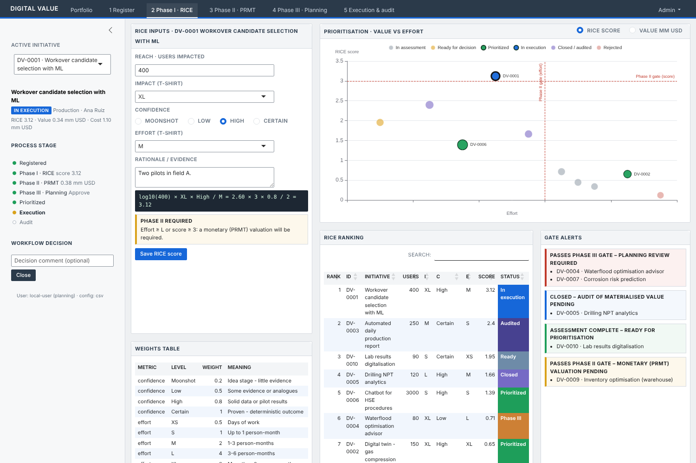
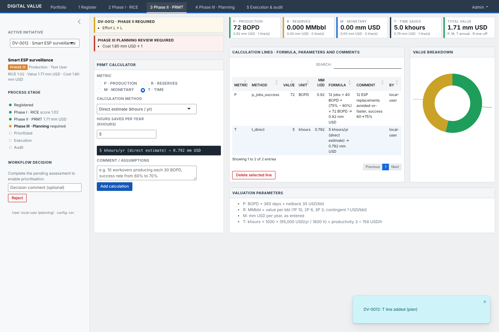
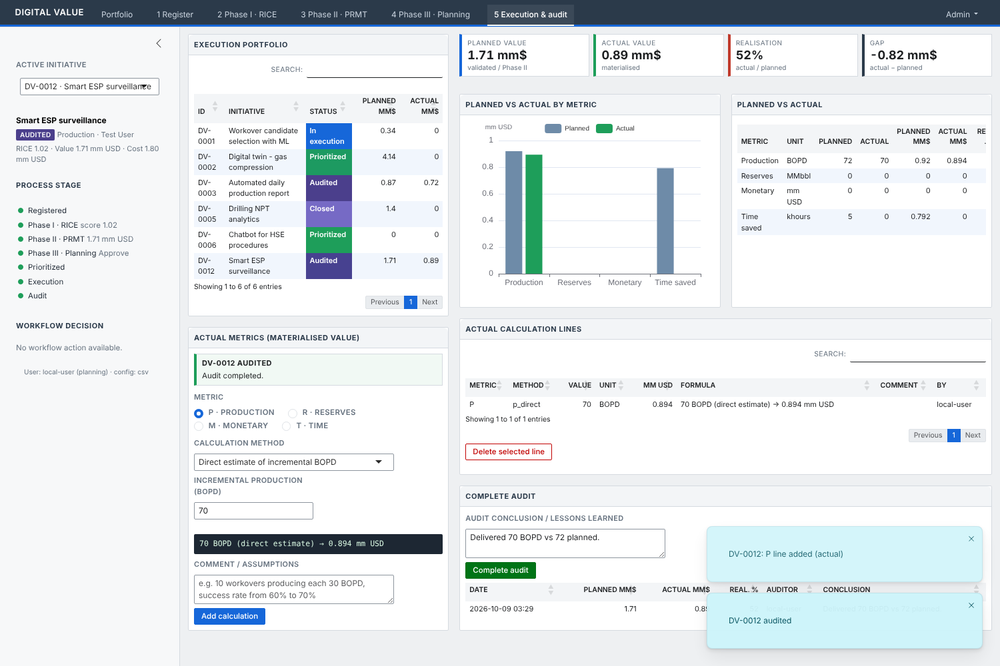
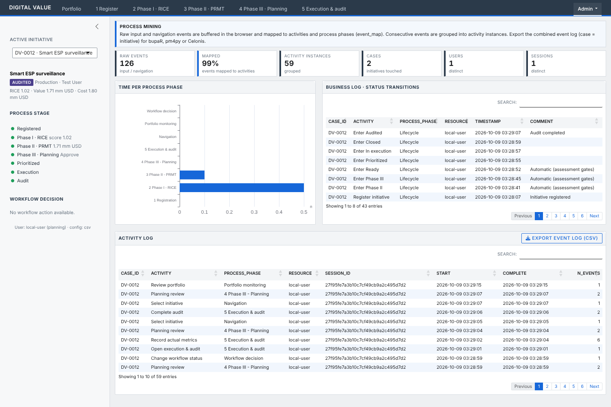

# digitalvalue — Digital Initiatives Value Assessment

Shiny application, built as an R package, for recording digital initiatives and assessing their value in stages:

| Stage | What happens | Who | Gate to the next stage |
|---|---|---|---|
| **1 Register** | Name, brief description, owner, business unit, estimated cost | Initiative owner | — |
| **2 Phase I · RICE** | Qualitative scoring used to compare and prioritise initiatives | Initiative owner | Phase II required if **effort ≥ L** or **RICE score ≥ 3** |
| **3 Phase II · PRMT** | Monetary valuation: **P**roduction, **R**eserves, **M**onetary, **T**ime saved | Initiative owner / engineer | Phase III required if **value ≥ 5 mm USD** or **cost ≥ 1 mm USD** |
| **4 Phase III · Planning** | Planning department's own evaluation: Approve / Rework / Reject, with validated value and cost | Planning group | — |
| **Decision** | Prioritize → Start execution → Close | Portfolio owner | — |
| **5 Execution & audit** | After closure, planning records the **actual** P/R/M/T using the same formulas and audits the value actually delivered | Planning group | — |

All thresholds and weights are configuration (see [Configuration](#configuration)).


## Valuation logic

### Phase I — RICE

`score = log10(users) × impact × confidence / effort`

* **Reach**: number of users reached, entered as a number and scored as `log10(users)`.
* **Impact** and **effort**: t-shirt sizes. **Confidence**: Moonshot → Low → High → Certain.
* The weights table (`inst/config/rice_scales.csv`):

| Dimension | Levels → weight |
|---|---|
| Impact | XS 0.25 · S 0.5 · M 1 · L 2 · XL 3 |
| Confidence | Moonshot 0.2 · Low 0.5 · High 0.8 · Certain 1 |
| Effort | XS 0.5 · S 1 · M 2 · L 4 · XL 8 |

### Phase II — PRMT

Each initiative can have any number of **calculation lines**. A line has a metric, a calculation method, its parameters, a comment, the human-readable formula, and the result converted to mm USD. The parameters are saved as JSON, so any valuation can be traced and recomputed later. For example:

```
[P] 10 jobs × 30 BOPD × (70% − 60%) = 30 BOPD → 0.383 mm USD
    comment: "10 workovers/yr, each 30 BOPD; ML lifts success from 60% to 70%."
    params:  {"n_jobs":10,"bopd_per_job":30,"success_before":60,"success_after":70}
```

| Metric | Methods | Converted to mm USD by |
|---|---|---|
| **P** Production (avg yearly BOPD) | direct · jobs × rate × success-rate uplift · uptime gain · decline mitigation | BOPD × 365 × netback (35 USD/bbl) — annual |
| **R** Reserves (MMbbl) | direct · recovery-factor uplift on OOIP; category 1P / 2P / 3P / contingent | MMbbl × value per bbl of the category (10 / 6 / 3 / 1 USD/bbl) — one-off |
| **M** Monetary (mm USD) | direct · events × saving per event · avoided cost × probability reduction | as entered — annual |
| **T** Time saved (khours) | direct · users × h/week × weeks · tasks × minutes saved | khours × 1000 × (salary / work hours) × productivity coefficient **3** — annual |

To add a method, add an entry to `prmt_methods()` in `R/fct_prmt.R`. The UI form is generated from the method's parameter list.

### Status workflow and alerts

Until a decision is taken, the status shows the next pending assessment (`Phase I` → `Phase II` → `Phase III` → `Ready`). It is recalculated after every save. Decisions (`Prioritized`, `In execution`, `Closed`, `Audited`, `Rejected`) are explicit actions in the sidebar, and every change is written to `status_history`.

The **alerts** list initiatives that passed a gate and need action: Phase II valuation pending, Phase III planning review required, ready for prioritisation, or closed but not yet audited. Clicking an alert opens the tab where the action is done.

In the **prioritisation scatter** (value vs effort, bubble size = reach), prioritized initiatives are **green**, initiatives in execution are **blue**, initiatives ready for a decision are amber, and the rest are muted. Dashed lines mark the gates.

### KPIs

The KPIs cover the portfolio (pipeline value, committed value, value/cost, realised value) and the assessment process itself:

* **Realisation rate**: actual value ÷ planned value of audited initiatives. Shows how accurate the valuations were.
* **Gate compliance**: share of initiatives that required Phase II / Phase III and actually got them.
* **Decision lead time**: median number of days from registration to the prioritise or reject decision.
* **Open alerts**: number of process actions still pending.

## Architecture

```
R/
  app_ui.R, app_server.R, run_app.R      app shell (bslib navbar + shared sidebar)
  mod_<tab>_ui.R / mod_<tab>_server.R    one pair per main tab (overview, register, phase1,
                                         phase2, phase3, audit, process, parameters, sidebar)
  mod_prmt_editor_ui.R / _server.R       PRMT calculator shared by Phase II and the audit
  fct_rice.R, fct_prmt.R, fct_gates.R,   business logic: pure functions, unit tested
  fct_kpi.R, fct_plots.R, fct_process_mining.R
  data_db.R                              ALL database access (single file)
  config.R                               configuration from pins (Connect) or CSV
  demo_data.R, utils_ui.R
inst/config/*.csv                        parameters, RICE weights, process-mining event map
inst/app/www/styles.css                  compact industrial theme
inst/app/www/process_logger.js           client-side activity buffering
tests/testthat/                          unit tests and module server tests (testServer)
```

* **Charts**: built as plain ECharts option lists (`*_option()` functions, unit tested) and rendered with `echarts4r`.
* **Users**: on Posit Connect, `session$user` and `session$groups` identify the user. Recording Phase III reviews and audits is limited to members of `DV_PLANNING_GROUP`; when that variable is unset, everyone can do it (development mode).

### Configuration

The parameters, gates, RICE weights and event map are stored as tables:

* **Posit Connect**: set `DV_PINS_BOARD=connect` (and optionally `DV_PINS_OWNER`). Publish the pins once with `digitalvalue::publish_config_pins()`. The pins are `dv_parameters`, `dv_rice_scales` and `dv_event_map`.
* **Local / fallback**: the CSV files in `inst/config` (or the folder in `DV_CONFIG_DIR`).

Environment variables are used only for infrastructure: `DV_DB_DRIVER`, `DV_DB_PATH`, `DV_PINS_BOARD`, `DV_PINS_OWNER`, `DV_PLANNING_GROUP`, `DV_SEED_DEMO`.

### Database

* **Development**: DuckDB file (`DV_DB_PATH`, default `digitalvalue.duckdb`). SQLite is supported as a fallback (`DV_DB_DRIVER=sqlite`).
* **Tables**: `initiatives`, `rice`, `prmt_lines` (stage `plan` or `actual`), `planning_reviews`, `audits`, `status_history`, `event_log`.
* **Migration to an enterprise database** (SQL Server, PostgreSQL, Oracle): only `R/data_db.R` changes. Add a driver branch in `db_connect()` (e.g. `odbc::odbc()` with the DSN from an environment variable). The SQL is kept ANSI (CTEs, window functions, `CASE`) and uses `?` placeholders; `sql_params()` already rewrites them to `$n` for PostgreSQL. Timestamps are stored as ISO-8601 UTC text, so no type mapping is needed.
* DuckDB allows only one writing process. On Connect, either keep **max processes = 1** during the pilot or move to a server database before scaling out.

## Process mining

The user activity log is built in four levels:

1. **Raw events**: every input change and tab navigation is captured in the browser by `process_logger.js`. Events are buffered and sent to the server every 5 s as a single JSON input, then appended to `event_log` with the user, session and active initiative.
2. **Mapped events**: input names are mapped to readable *activities* and *process phases* with regexes from `event_map.csv` (for example, `phase2-editor-add` → "Add PRMT calculation" / "3 Phase II - PRMT").
3. **Activity instances**: consecutive events with the same activity, initiative and session are collapsed into one instance with start and complete timestamps. An idle gap of 10 minutes starts a new instance.
4. **Business log**: status transitions, the authoritative lifecycle of each case.

**Admin → Process log** shows the time spent per phase and the mapping coverage, and exports a standard event log (`case_id`, `activity`, `timestamp`, `resource`, `lifecycle`) for bupaR, pm4py or Celonis.

## Performance: moving work out of the Shiny R process

Already in place:
* **Database**: portfolio aggregation (PRMT totals per metric, latest review, latest audit) runs as one SQL query in DuckDB (`db_portfolio()`), not in R.
* **Client**: chart rendering (ECharts) and activity buffering run in the browser. The R process receives one batched input every 5 s instead of one per keystroke.

Proposed next steps:
* **API**: expose the RICE/PRMT valuation engine (`rice_assess()`, `prmt_calculate()`) through a plumber API on Connect. Other tools (Excel, Power BI, other apps) can then use the same formulas, and the work can be scaled separately from the UI.
* **Database**: put the KPI and process-mining aggregations (`build_activity_log`, `phase_effort`) into SQL views or scheduled materialisations, e.g. a Quarto/R Markdown job on Connect that writes a pin or table every night. The app then only reads the results.
* **Caching**: wrap the portfolio query in `shiny::bindCache()` keyed on a data-version counter so that sessions share the result.
* **Client**: use DT server-side processing, or move to `reactable` for large registers.

## Running

```r
# install dependencies (shiny, bslib, DT, echarts4r, DBI, duckdb, pins, jsonlite)
pkgload::load_all(); run_app()          # development
shiny::runApp()                          # uses app.R
```

**Deployment to Posit Connect**: `rsconnect::deployApp(appFiles = c("app.R", "DESCRIPTION", "NAMESPACE", "R", "inst"))`. Set `DV_DB_PATH` to a persistent location, plus `DV_PINS_BOARD=connect` and `DV_PLANNING_GROUP`.

**Tests**: `devtools::test()` or `testthat::test_local()`. The tests use an in-memory DuckDB, or SQLite when DuckDB is not installed.

## Screens

| | |
|---|---|
|  |  |
|  |  |
